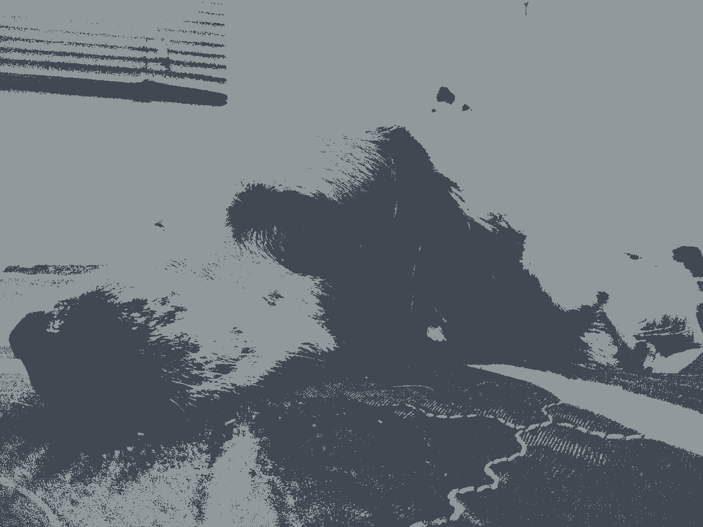

# Image Compression with Deterministic K-Means

This project consists of the implementation of the k-means algorithm with deterministic initialization and an utility to "compress" images using this algorithm.

Even though the k-means algorithms is a programmed as a stand-alone function, it is optimized to have better performance when used for compressing images.

Here is a sample of what this implementation can do:

## Original Image

## Compressed Images:
### 2 Colors

### 4 Colors

### 8 Colors

### 16 Colors

### 32 Colors

The objective of this implementation was finding different deterministic
initialization functions to compare them and see which obtains a better MSE. This is still under development since the implementation is still a work in process
but I'm getting there.
